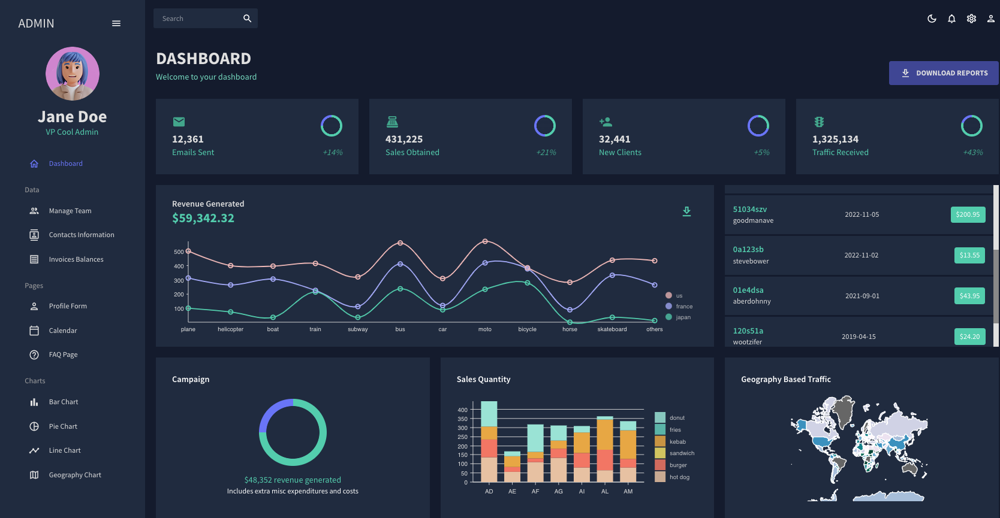

# Admin-Dashboard-React
An administration dashboard app created in react. This application consists of Light and Dark Mode, 4 different Charts, 3 different Data Table Pages, FAQ Page, Form Page, and Calendar Integration.

 
 
<!-- Technologies used -->

 
<h2 align="left">🛠 Languages and Tools:</h2>
 

 
 
</a>

</a>

 
<!-- Screenshot -->
   

 
 

   <!-- Online link -->
   
 
<h2 align="left">👀 View online:</h2>
 
<a href="https://deftpegadmindashboard.netlify.app/" target="_blank" rel="noreferrer">
Take me to the website, </a>
or alternately, click on the image 👉

